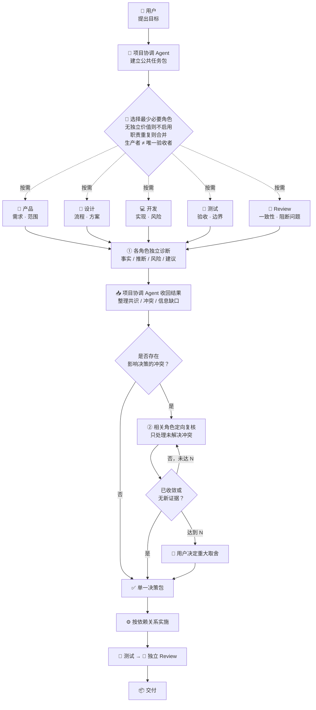
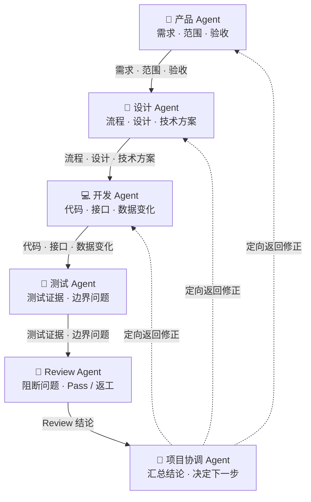

# 多角色 Agent 协作探索笔记

> 定位：本文档用于探索学习，不是当前项目的执行规则。

> 核心：允许角色互相批评、修正和影响，但讨论必须由项目协调 Agent 组织，围绕明确冲突进行，并且能够按条件停止。

## 一、一句话定义

**先独立诊断，再定向交叉评审，最后由项目协调 Agent 集中汇总。**

不是：

- 所有角色从开始就看到全部发言。
- 所有角色自由回复彼此。
- 用多数投票代替证据和责任。
- 在没有停止条件的情况下重复讨论。

## 二、全局流程



## 三、最小角色分工

| 角色 | 本轮只回答的问题 | 标准输出 |
|---|---|---|
| 项目协调 Agent | 谁处理什么，冲突如何收敛？ | 任务包、冲突表、决策包 |
| 产品 Agent | 用户问题、目标、范围和验收标准是否明确？ | 用户场景、范围、排除项、验收标准 |
| 设计 Agent | 用户流程、交互、视觉或技术方案是否合理？ | 流程、状态、方案、可用性风险 |
| 开发 Agent | 如何最小实现，有哪些依赖和技术风险？ | 实现方案、影响模块、数据变化、回退方案 |
| 测试 Agent | 验收标准是否可测，哪些边界容易失败？ | 正常、异常、边界和回归用例 |
| Review Agent | 需求、设计、实现和测试是否一致？ | 阻断问题、非阻断建议、Pass / 返工 |

小任务可以合并角色，但不能合并两条责任边界：

- 全局协调与专业执行必须区分。
- 生产者不能是唯一验收者。

## 四、四阶段讨论法

### 1. 建立公共任务包

```text
目标：本次只解决什么
背景：为什么要解决
范围：本次包含什么
排除项：本次不做什么
不变量：无论如何不能改变什么
验收标准：什么状态算完成
停止条件：何时返回协调 Agent 或用户
```

### 2. 第一轮：独立诊断

- 各角色接收同一份任务包。
- 暂时不查看其他角色的结论。
- 每个角色从自己的专业责任独立分析。
- 输出必须区分：事实、推断、风险和待确认问题。

目的：避免后发角色附和前面的观点，也避免错误被多个角色相互强化。

### 3. 协调 Agent 整理冲突

只整理三类内容：

- 已经达成的共识。
- 影响方案的真实冲突。
- 阻止继续执行的信息缺口。

| 冲突 | 角色 A | 角色 B | 影响 | 下一步 |
|---|---|---|---|---|
| 问题是什么 | 结论与证据 | 结论与证据 | 不处理的后果 | 交给谁复核 |

没有冲突的角色不进入下一轮。

### 4. 第二轮：定向交叉评审

协调 Agent 只把相关冲突和证据发给相关角色，并要求其在四种回复中选择一种：

1. 接受意见并修改方案。
2. 部分接受并提出折中方案。
3. 保留原结论并补充证据。
4. 标记为必须由用户决定。

禁止：

- 离开当前争议扩大任务范围。
- 直接篡改其他角色的产物。
- 用角色身份或多数投票代替证据。
- 在没有新证据时要求新一轮讨论。

## 五、角色如何互相影响

角色之间不直接修改彼此结论，而是通过可检查的共享产物产生影响。



可共享的产物包括：

- 需求说明和验收标准。
- 设计稿、用户流程和架构方案。
- 接口契约和数据结构。
- 代码变更和版本说明。
- 测试计划、执行结果和失败证据。
- Review 结论、风险清单和决策记录。

## 六、并行和顺序的判断

可以并行：

- 产品检查需求完整性。
- 设计检查用户体验和方案合理性。
- 开发评估技术可行性和风险。
- 测试检查验收标准是否可测。
- Review 检查范围、安全和一致性。

必须顺序：

```text
需求确认
→ 正式设计
→ 代码实现
→ 测试验证
→ 独立 Review
→ 修复
→ 重新验证
```

判断原则：**后一任务需要前一任务的输出时，不并行。**

## 七、决策与批准边界

- 专业角色：提供本专业结论、证据、风险和修改建议。
- 项目协调 Agent：分配任务、整理冲突、选择下一步，不代替用户做重大取舍。
- 用户：决定产品目标、优先级、重大范围变化、高风险操作和最终交付。

需要用户确认的典型情况：

- 目标或范围发生实质变化。
- 两个重要目标无法同时满足。
- 存在破坏性、不可逆或高风险操作。
- 需要新的外部授权、成本或人员协作。
- 专业角色达到预设最大轮次 N 后仍无法收敛。

## 八、停止条件

同时满足以下条件即停止讨论：

- 范围和排除项明确。
- 验收标准可执行、可测试。
- 不存在未处理的阻断冲突。
- 主要风险已有处理或回退方案。
- 每个关键产物都有责任人。
- 剩余取舍已交给用户。

轮次上限：

- N 是最大总轮次，不是必须执行满。
- 默认 N=2：第 1 轮独立诊断，第 2 轮定向交叉评审。
- 复杂或高风险任务可设 N=3。
- 第 2…N 轮只处理未解决的阻断冲突。
- 已收敛或没有新证据时提前停止。
- 达到 N 仍未收敛时，停止讨论并交给用户。

## 九、一分钟日常检查

开始前：

- [ ] 本次是否只有一个明确目标？
- [ ] 是否真的需要多角色？
- [ ] 每个角色的责任是否不重复？
- [ ] 是否写明范围、排除项、不变量和验收标准？

讨论中：

- [ ] 是否先独立诊断，再交叉评审？
- [ ] 是否只向相关角色发送冲突？
- [ ] 结论是否区分事实、推断和不确定性？
- [ ] 是否使用证据而不是多数投票？
- [ ] 是否出现了无边界扩大或重复讨论？

交付前：

- [ ] 生产者之外是否有独立验收？
- [ ] 验收标准是否全部满足？
- [ ] 风险、限制和未决事项是否已明确记录？
- [ ] 重大取舍和最终交付是否已由用户确认？

## 十、最小记录模板

```text
本轮目标：

参与角色：

独立诊断：
- 角色：结论 / 证据 / 风险

冲突清单：
- 冲突：角色 A 观点 / 角色 B 观点 / 影响

交叉评审结果：
- 接受 / 折中 / 保留并补充证据 / 交给用户

最终决定：

责任人与下一步：

停止条件：
```
