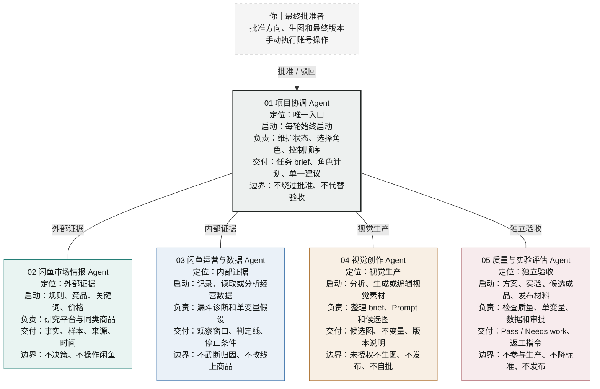
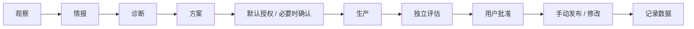

# 当前角色与流程

> 本页是给用户日常查看的角色速查入口，不是独立执行规则。内容冲突时，以根目录 [AGENTS.md](./AGENTS.md) 为准。

## 角色地图



专家不互相自由 handoff，也不接管用户对话。项目协调 Agent 按任务信号调用必要角色，专家完成职责后返回协调者。

## 默认流程



- 只有互不依赖的调研可以并行；诊断、方案、生产、评估、批准和发布按顺序执行。
- 角色按任务信号启动，不代表每轮都调用全部角色。
- 图片任务必须先汇总当次方案；方案完整且无待确认事项时按持续默认授权直接生图，存在关键歧义或冲突时暂停确认。
- 闲鱼商品图片只有“商品首图”一种类型，每个案例可以有 `1..N` 个构图、背景或尺寸变体。
- 不生成详情图，不为发布快照或相同用途创建重复图片。
- 本项目不设发布执行 Agent；账号操作由用户确认并手动执行。

## 角色速查

| 角色 | 什么时候启动 | 主要交付 | 明确边界 |
|---|---|---|---|
| 项目协调 Agent | 每轮始终启动 | 任务 brief、角色计划、执行顺序、单一建议 | 不绕过审批，不把汇总当独立验收 |
| 闲鱼市场情报 Agent | 查询平台规则、竞品、关键词、价格等外部信息 | 有来源和时间的事实、样本与不确定性 | 不决定商品修改，不操作闲鱼 |
| 闲鱼运营与数据 Agent | 记录、读取或分析曝光到成交的数据 | 漏斗诊断、一个假设、单变量实验 | 不把小样本当结论，不直接改线上商品 |
| 视觉创作 Agent | 分析、生成或编辑 Logo、商品图等素材 | brief、实际 Prompt、候选图和版本说明 | 方案未明确不生图，不发布，不自批 |
| 质量与实验评估 Agent | 形成方案、实验、候选成品或发布材料 | `Pass` / `Needs work`、证据和返工指令 | 不参与生产，不降低标准，不发布 |

## 常见任务路由

| 当前事项 | 必需角色 | Skill 或资料 | 用户门禁 |
|---|---|---|---|
| 查询当前闲鱼规则 | 项目协调、市场情报 | 官方来源和带时间的查询记录 | 无 |
| 记录新的商品数据 | 项目协调、运营与数据 | 对应案例的商品数据记录 | 无 |
| 优化标题、价格、介绍或服务定位 | 项目协调、市场情报、运营与数据、质量评估 | 市场样本、内部数据、单变量方案 | 用户确认并手动修改 |
| 修改商品首图或其变体 | 项目协调、视觉创作、质量评估 | `imagegen`、已确认方案和品牌不变量 | 方案明确后默认生图；发布前再次批准 |
| 新建 Logo 复刻案例 | 项目协调、视觉创作、质量评估 | [`$recreate-logo`](./.agents/skills/recreate-logo/SKILL.md) + `imagegen` | 方案明确后默认生图；最终成品由用户确认 |
| 发布、改价、下架或删除 | 项目协调；按同时涉及的内容优化、图片修改或数据记录信号增加对应角色 | 当前事项所需资料 | 用户批准并手动执行 |

## 角色、Skill 与文件

```text
角色：谁负责
Skill：具体怎么做
案例文件：做完后保存什么
```

新建 Logo 复刻案例时，项目协调 Agent 负责路由，视觉创作 Agent 按 `$recreate-logo` 执行，质量与实验评估 Agent 独立验收。实际调用 Prompt、生成记录和案例工作台的归档方式由 `$recreate-logo` 规定，不另设 Prompt 文件管理角色。

## 文档入口

- [AGENTS.md](./AGENTS.md)：唯一执行规则源。
- [Agent 角色管理索引](./Agent角色管理/README.md)：当前项目角色文档与探索笔记的入口。
- [闲鱼与 GPT Image 2 项目角色体系](./Agent角色管理/当前项目/闲鱼与GPT-Image-2角色体系.md)：完整职责、设计依据和调用方式。
- [角色自动路由测试](./Agent角色管理/当前项目/角色自动路由测试.md)：固定路由用例与预期。
- [角色自动路由盲测结果](./Agent角色管理/当前项目/角色自动路由盲测结果.md)：独立测试记录。
- [`$recreate-logo` Skill](./.agents/skills/recreate-logo/SKILL.md)：Logo 复刻的唯一通用执行流程。
- [已知失败与恢复工作台](./项目规范/已知失败与恢复/已知失败与恢复工作台.md)：项目级失败知识导航；完整规则保存在独立条目。

## 同步规则

角色名称、职责、自动路由或用户权限门发生变化时，必须在同一次修改中同步更新本页。本页不保存曝光、浏览、想要、咨询、成交等易过期业务数据。
